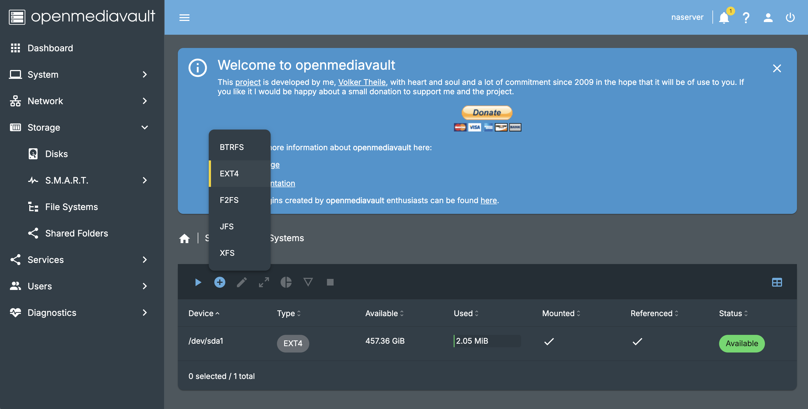
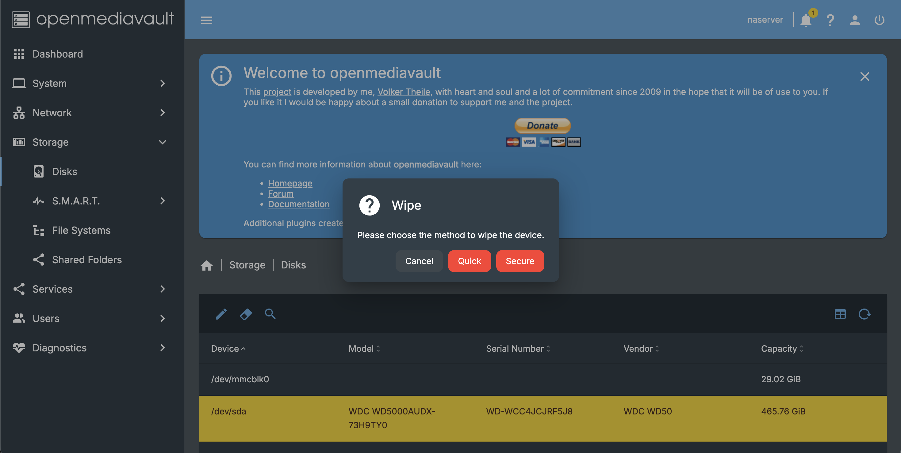
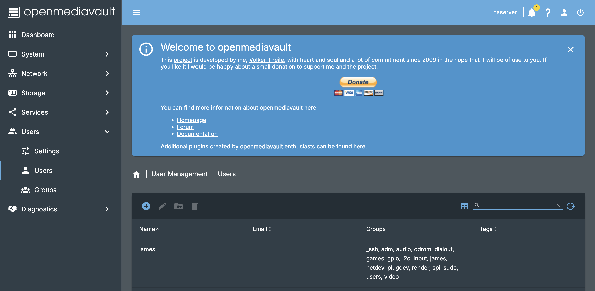
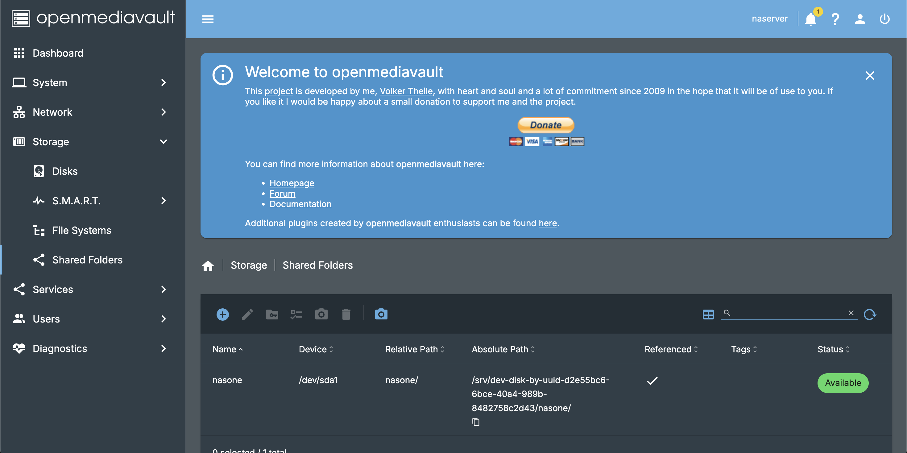
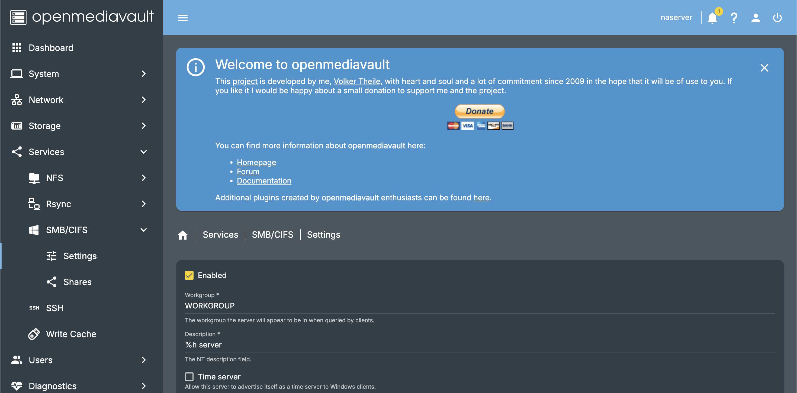
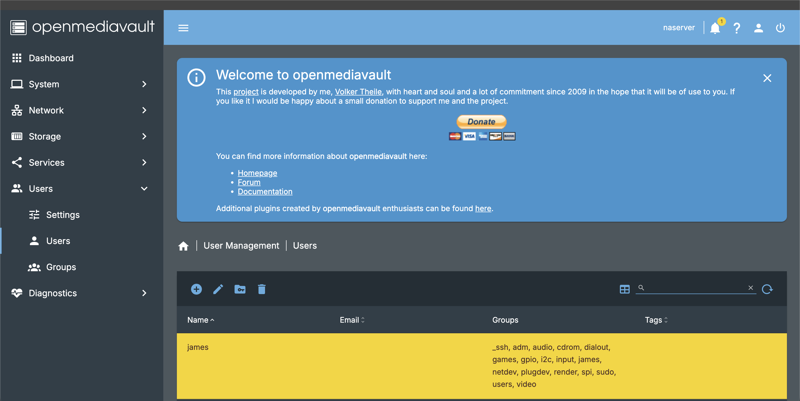

Before OMV installation update the system:
```bash
sudo apt update
sudo apt upgrade -y
```

After, download OMV (The process of installation may take around 15-25 minutes):
```Bash
wget -O - https://github.com/OpenMediaVault-Plugin-Developers/installScript/raw/master/install | sudo bash
```

Do a system reboot after.

# Running and logging into OMV

* Run a browser and type in the address bar:
```
http://RPi_IP_ADDRESS
```

* Signing in to OMV by default:
```
User: admin
Password: openmediavault
```

# OMV configuration

### Formatting & Wiping
It doesn't matter what type of disk there is (HDD, SDD...), the service assumes to work with EXT4 as a filesystem.
If you have an absolutely new disk without any file - format it:

* Path: Storage > Disks > Create


If you have a disk that has data - wipe it before formatting

* Path: Storage > Disks > Wipe


Then do the previous procedure above (formatting).

****
### Creating a user
It is inconvenient and insecure for daily usage to work as a root in OMV (e.g. there's a chance to break something). Therefore creating a new user with lesser rights is an idea to prevent that happening.

* Path: User management  > Users > Create


It is enough to define a user for daily usage as a login and password only.

******
### Creating a shared directory with SMB/CIFS
In order to interact with files by multiple client devices - it is necessary to have a shared directory with SMB/CIFS protocols.

* Path: Storage > Shared Folders > Create

(Keep permissions by default).

* Path: Services > SMB/CIFS > Settings > Enabled


*****
### Add user to share directory
In order to the changes came into effect, it must to add the user right into the shared directory.

* Path: User management > Users > Shared Folder Permissions > Read/Write

